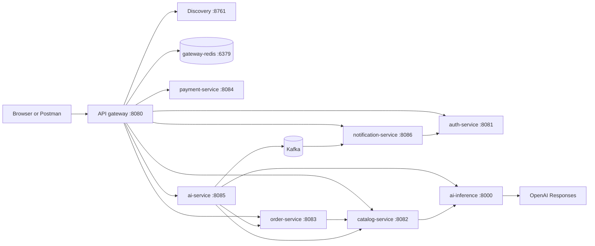
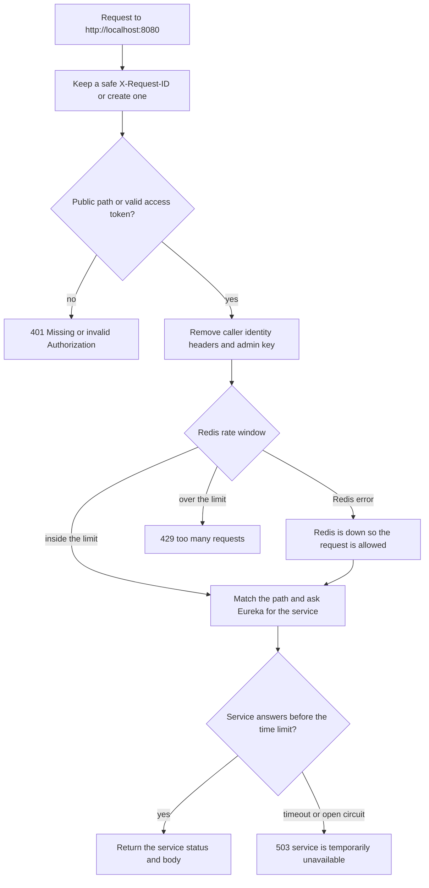
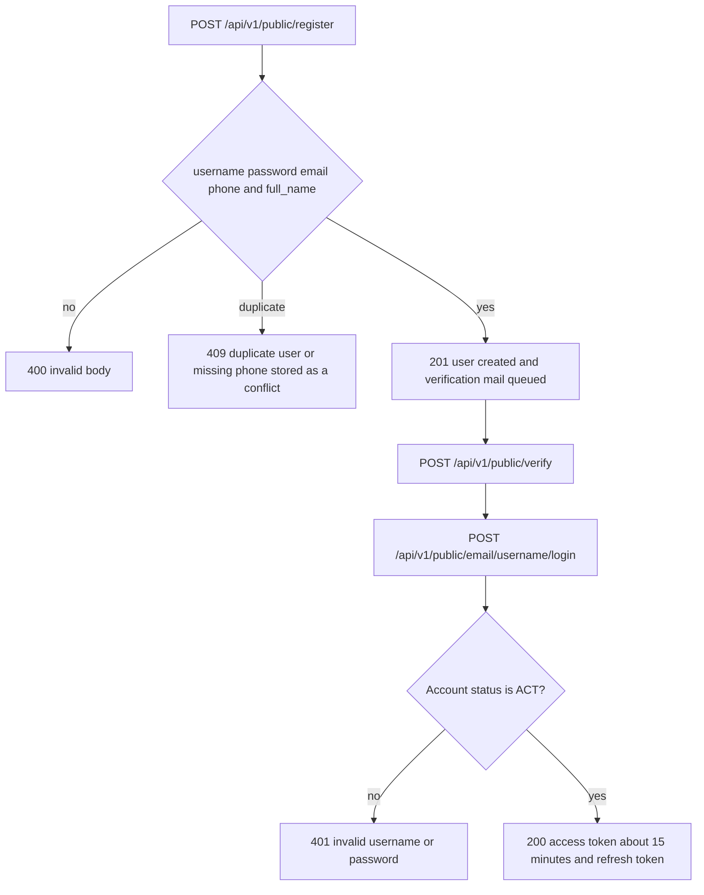
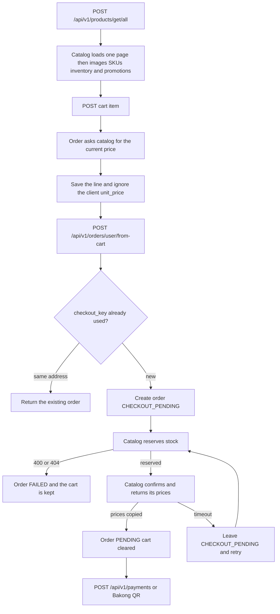
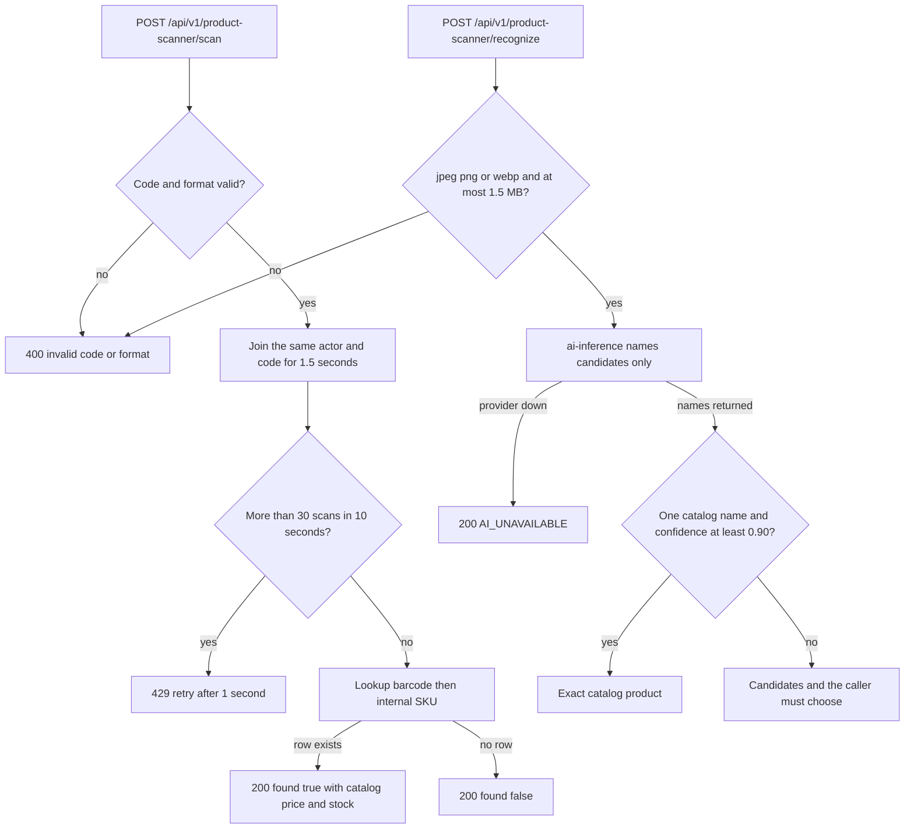
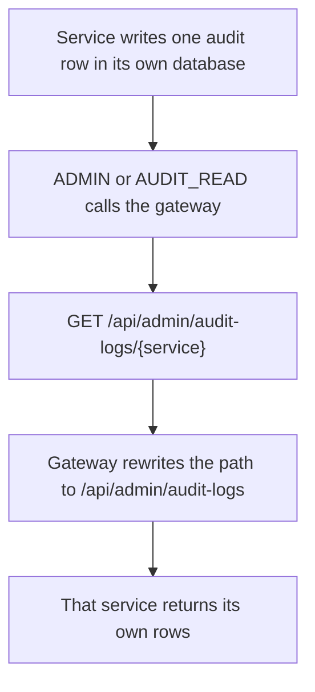

# E-Shop flowchart

The browser and Postman talk only to the API gateway on port 8080. Each service keeps its own database. Redis is shared for the gateway rate limit and a startup ping. Stock and promotion prices are read from catalog on every request.

One image of the whole path: [full.png](flowchart/full.png).

Separate sheets: [services](flowchart/services.png), [gateway](flowchart/gateway.png), [account](flowchart/account.png), [buy](flowchart/buy.png), [scanner](flowchart/scanner.png), [AI](flowchart/ai.png), [audit](flowchart/audit.png).

## 1. Services



Auth, catalog, order, and payment use the Postgres databases on ports 5432–5435. Gateway, AI, and notification use 5436–5438. Discovery and ai-inference do not use Redis.

## 2. Every request through the gateway



Public paths are registration, verification, login, refresh, password reset, session login, active promotions, and OpenAPI. Product, scanner, cart, order, payment, AI, and notification calls need a bearer token or the access cookie. The usual time limit is 6 seconds. Catalog's HTTP client limit is 5 seconds. AI is allowed 30 seconds. A slow first start can return 503; the same call succeeds on retry.

## 3. Account



Seed users must be stored as `ACT`. `ACTIVE` is rejected. Session login at `/api/v1/public/session/login` sets HttpOnly cookies instead of returning the tokens in JSON.

## 4. Buy a product



Catalog is the only writer of stock and of the price used on the order. The client cannot send a product id, a price, or a stock count that the services trust. Payment is a separate call after the order is `PENDING`.

## 5. Product scanner



A scan does not create a product, change stock, or change `ProductSku.price`. The example code `8850123456787` is a valid EAN-13. Warehouse location is returned only to ADMIN, MANAGER, and STAFF.

## 6. AI request and notification

```mermaid
flowchart TD
  call[POST /api/ai/execute with message]
  replay{Same Idempotency-Key for this user?}
  saved[Return the saved status and do not run the tool]
  tools[List the tools this actor may use]
  route[POST /api/v1/ai/route on ai-inference]
  model[OpenAI selects one supplied tool]
  trust{Confidence at least 0.80 and parameters valid?}
  unclear[422 NEEDS_INPUT and nothing is called]
  fixed[ai-service calls one fixed catalog or order client]
  record[Save execution audit and outbox together]
  bus[Kafka notification.events.v1]
  inbox[notification-service writes one in-app row]
  mail{aiEmail preference on?}
  smtp[auth-service sends the mail]

  call --> replay
  replay -->|yes| saved
  replay -->|no| tools --> route --> model --> trust
  trust -->|no| unclear
  trust -->|yes| fixed --> record
  record -->|read| stopNode[No notification]
  record -->|write finished| bus --> inbox --> mail
  mail -->|yes| smtp
  mail -->|no| inboxOnly[In-app notification only]
```

ai-inference never receives the shop URL, the caller token, or permission to call another service. `ORDER_CANCEL`, `PAYMENT_REFUND`, and `ROLE_GRANT` stay disabled. A write that times out after it was sent stays `UNKNOWN` until execution history is checked. Reads do not send a notification.

The caller then uses `/api/notifications` to list, count, and mark rows read.

## 7. Audit



`{service}` is `auth`, `catalog`, `order`, `payment`, `ai`, or `notification`. The audit row stores the action and the request id. It does not store the AI prompt, the model parameters, or the downstream response body.
